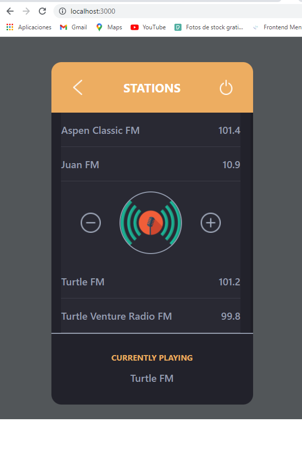

# turtleTask

    

# Challenge Fullstack - Turtle Venture

## Objectives
Meet the following points:
## 01: LightSwitch
- HTML / CSS / Javascript / DomElements
### Your task would be creating a web page containing a bulb. If I click on the bulb it should be switched on or off.

  

  

After cloning the project, on 01-lightBulb folder, open index.html with Live Server.

## 02: Fetch Api Response
- BearerToken JSON
### Your task would be fetching api response from a specific api endpoint using any two programing language such as Javascript, PHP, Python, Golang, Java

#### Credentials: 
##### 1. Endpoint: https://gorest.co.in/public/v1/users
##### 2. Token: d7c01847de4c083cb154e9a533294301e9f05f93dbae7d589e42ece63226c0a3

Answer on 02-fetchApiResponse. (Javascript/Python)

## 03: Radio Widget
- React / Redux / Css Modules / Typescript
### Application Requirements/Rules & Hints
#### 1. Widget is mostly static - selecting station is the only action available. After selecting station, it should toggle it and display its name at the bottom of the widget.
#### 2. Rest of the buttons should be clickable but it should trigger no action.

### Additional requirements & Hints:

#### 1. React.
#### 2. TypeScript or Proptypes (TypeScript would be much more appreciable).
#### 3. CSS Modules (https://github.com/css-modules/css-modules).
#### 4. Even though the radio station list is predefined - the application should be ready to accept the stations from the backend service.
#### 5. Redux Toolkit or Redux could be used (not required).
#### 6. Transition/motion smoothness would be appreciated (not required).
#### 7. Pay attention to code quality, formatting, conventions etc.

### VERCEL FRONTEND DEPLOY: https://turtle-task.vercel.app/

  

## 04: API Server
- Node / Express / MongoDb / oAuth2
### Your task would be creating an API server with Node.js, where users can maintain their radio stations.

### Application Requirements/Rules & Hints
#### 1. Signup & Sign In.
#### 2. API to fetch, create, update and delete stations

### Additional requirements & Hints:

#### 1. MongoDB Database.
#### 2. Authentication (oAuth2 would be appreciable)
#### 3. API Docs 
#### 4. Pay attention to code quality, formatting, conventions etc.

<pre>
First you need to create a MongoDb cluster.
Then create a .env file.
  Set your enviorment variables:
 
   MONGODB_CNN
   USER
   PASSWORD

Create an API Auth0 authentication app and set your own JWKSURI, AUDIENCE, ISSUER in .env and connect to your Mongo DB database using:

  const client = new MongoClient(`mongodb+srv://${configuration.USER}:${configuration.PASSWORD}@<dBname>.vw9e1.mongodb.net/?retryWrites=true&w=majority`);
  
 in the "Database Action Scripts" tab in the Auth0 dashboard.
  
  
In order for this to work an auth0 token is required (except for the /get route).
Login here: https://turtle-task.vercel.app/
Copy token.
Get to postman documentation. 
In the Headers tab, type in a new header request: 
    key: authorization 
    value: Bearer {yourToken}
</pre>

Api documentation (Postman) : https://documenter.getpostman.com/view/15184428/UyxoijAQ

## Apartado de Operaciones

  

Esta pantalla muesta la totalidad de las operaciones. Podemos agregar nuevas, editar y actualizar en la DB las que ya están cargadas, así como eliminarlas. No se puede editar el tipo de operación, ingreso o egreso (tal como pide la consigna).

## Registro y Login 

  

El visitante que desee utilizar Alkemy Wallet deberá registrarse mediante Email y Password. El backend le devolvera un JWT que será utilizado para verificar la identidad del usuario en cada petición.

## Diseño responsive con Next UI. 

  

Deploy: Heroku y Vercel.

Link:
<a href="https://alkemy-fullstack.vercel.app/">https://alkemy-fullstack.vercel.app/</a>

Para correrlo localmente:
- clonar el repositorio
- instalar las dependencias (npm install).
- Crear base de datos postgreSQL y declarar variables de entorno: DB_USER, DB_PASSWORD, DB_HOST, DB_NAME.  
- Desde la carpeta api/, ejecutar npm start para iniciar el servidor. 
- Desde la carpeta client/, ejecutar npm start para darle inicio al browser. 

