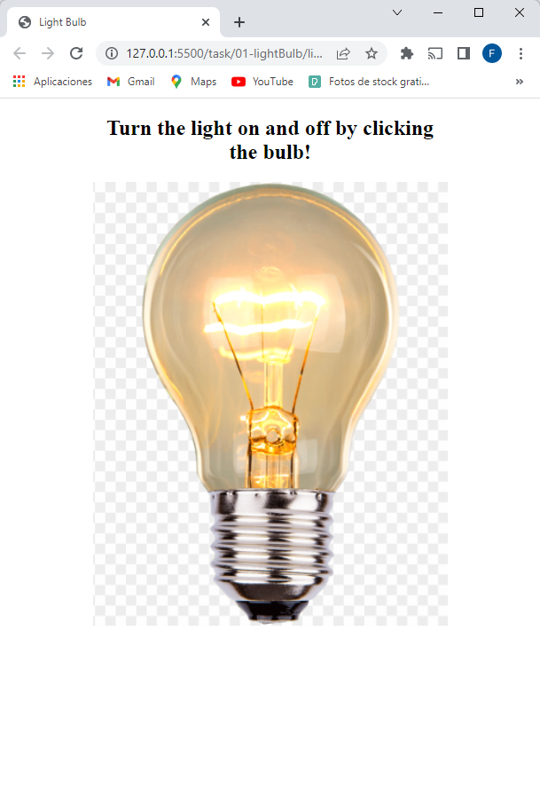

# turtleTask

    

# Challenge Fullstack - Turtle Venture

## Objectives
Meet the following points:
- 01: LightSwitch
- HTML / CSS / Javascript / DomElements
### Your task would be creating a web page containing a bulb. If I click on the bulb it should be switched on or off.

  

  

After cloning the project, on 01-lightBulb folder, open index.html with Live Server.

- 02: Fetch Api Response
- BearerToken JSON
### Your task would be fetching api response from a specific api endpoint using any two programing language such as Javascript, PHP, Python, Golang, Java
- Javascript
 <pre>const URL = 'https://gorest.co.in/public/v1/users';
const TOKEN =
	'd7c01847de4c083cb154e9a533294301e9f05f93dbae7d589e42ece63226c0a3';

const list = document.getElementById('list');

const getData = async (url) => {
	const res = await fetch(url, {
		headers: {
			'Content-Type': 'application/json',
			Authorization: `Bearer ${TOKEN}`,
		},
	});
	const data = await res.json();

	//Just to show some data
	data.data.forEach((user) => {
		const li = `<li>${user.name}</li>`;
		list.innerHTML += li;
	});

	//return response from api
	return data;
};

getData(URL) </pre>

-Python

<pre>
import requests
from requests.structures import CaseInsensitiveDict

URL = 'https://gorest.co.in/public/v1/users';
TOKEN ='d7c01847de4c083cb154e9a533294301e9f05f93dbae7d589e42ece63226c0a3';

headers = CaseInsensitiveDict()
headers["Accept"] = "application/json"
headers["Authorization"] = "Bearer {TOKEN}"

# response from api
response = requests.get(URL, headers=headers)

data = response.json()

print(data)
</pre>

La aplicación cuenta con autenticación de usuarios y verificación JWT.  

## Home

  

Esta pantalla muesta las ultimas 10 operaciones cargadas por el usuario, junto con el balance TOTAL (incluyendo las demas operaciones, llegado el caso en que sean mas de 10) y un gráfico que muestra las porciones de ingresos y egresos totales de dinero.

## Apartado de Operaciones

  

Esta pantalla muesta la totalidad de las operaciones. Podemos agregar nuevas, editar y actualizar en la DB las que ya están cargadas, así como eliminarlas. No se puede editar el tipo de operación, ingreso o egreso (tal como pide la consigna).

## Registro y Login 

  

El visitante que desee utilizar Alkemy Wallet deberá registrarse mediante Email y Password. El backend le devolvera un JWT que será utilizado para verificar la identidad del usuario en cada petición.

## Diseño responsive con Next UI. 

  

Deploy: Heroku y Vercel.

Link:
<a href="https://alkemy-fullstack.vercel.app/">https://alkemy-fullstack.vercel.app/</a>

Para correrlo localmente:
- clonar el repositorio
- instalar las dependencias (npm install).
- Crear base de datos postgreSQL y declarar variables de entorno: DB_USER, DB_PASSWORD, DB_HOST, DB_NAME.  
- Desde la carpeta api/, ejecutar npm start para iniciar el servidor. 
- Desde la carpeta client/, ejecutar npm start para darle inicio al browser. 

